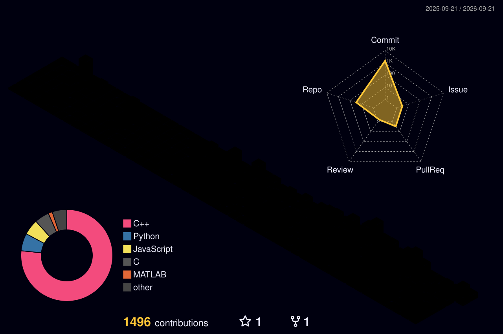

# Hi there, I'm Madhav Zanwar! 

  

  
  

## About Me

Hello! I'm **Madhav Zanwar**, an AI/ML student who enjoys turning ideas into working products — from real-time computer vision demos to full-stack platforms built under hackathon deadlines. I care most about projects that actually help people, especially around accessibility and social impact.

- 🔭 Currently building **ReadMorph**, an accessibility platform that makes documents easier to read for people with dyslexia through dyslexia-friendly typography, AI-powered simplification, and text-to-speech
- 🏆 Actively competing in hackathons and ideathons with my team, **Algorithm Avengers**
- 🌱 Strengthening my fundamentals in **Python, C++, DSA, and Git/GitHub**
- 🧠 Focused on improving **problem-solving & logical thinking**
- 🤝 Open to **beginner-friendly open-source contributions**
- ⚡ Goal: Crack **GSoC 2026** and keep building strong, real-world dev skills

---

## 🧠 Tech Stack & Skills

### 💻 Programming Languages

### 🎨 Frontend Development

**Also familiar with:** 

### 🗄️ Databases & Cloud

### 🤖 AI/ML & Data Science

### 🛠️ Development Tools

---

## 🚀 Featured Projects

### 🎨 QuickSketch — Real-Time Sketch Recognition AI
**Tech Stack:** HTML5 Canvas, CSS3, JavaScript, Flask, Flask-CORS, PyTorch, NumPy, Pillow
- Full-stack AI web app that recognizes hand-drawn sketches in real time — draw, hit Predict, get ranked results in under a second
- Custom-trained PyTorch CNN classifying across **16 categories**, achieving **95.9% validation accuracy** on 16,000 held-out samples
- Trained on the Google Quick Draw dataset (.npy bitmap format), returning ranked predictions with confidence scores
- Built end-to-end: HTML5 Canvas frontend + Flask/Flask-CORS backend serving the PyTorch model

### 🧠 Placement AI — AI-Powered Placement Prep Platform
🔗 [github.com/madhavzanwar/placement-ai](https://github.com/madhavzanwar/placement-ai)
**Tech Stack:** Flask, HTML, CSS, JavaScript + AI integration
- Resume parsing + placement readiness scoring
- Mock interview system covering behavioral and technical rounds
- Dashboard for skill tracking and personalized roadmap

### 👤 PCA Face Recognition — MATLAB
🔗 [github.com/madhavzanwar/PCA-Face-Recognition-MATLAB](https://github.com/madhavzanwar/PCA-Face-Recognition-MATLAB)
**Tech Stack:** MATLAB
- Face recognition system using PCA (Eigenfaces)
- Implemented Eigenfaces-based recognition with feature extraction
- Achieved **93.75% accuracy** on the ORL dataset
- Applied dimensionality reduction & face reconstruction

---

## 🧩 LeetCode Stats

  

---

## 3D Contribution Calendar

  

---

## 📊 GitHub Stats

  
  

---

## 🌐 Connect With Me

  
  

